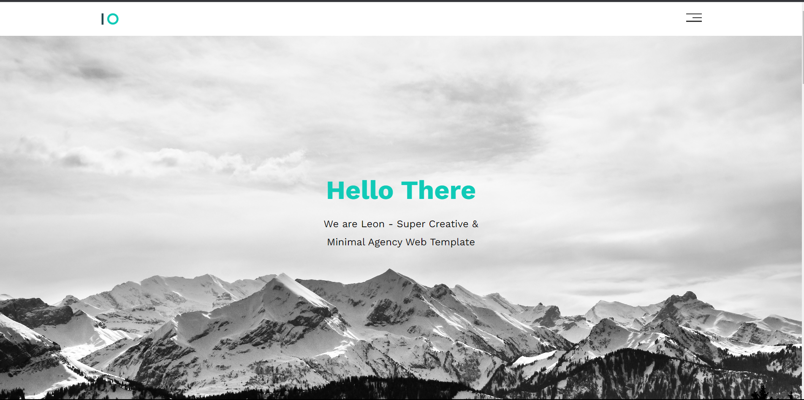

<!-- Project Screenshot -->
<p align="center">
  
</p>

<!-- Project Title -->
<h1 align="center" style="font-size: 36px; color: #333;">🚀 My Super Cool Website 🚀</h1>

<!-- Project Description -->
<p align="center" style="font-size: 18px; color: #666;">
  Welcome to my stunning website, where creativity meets HTML and CSS expertise.
</p>

<!-- Key Features -->
<p align="center" style="font-size: 18px; color: #666;">
  ✨ Clean Design | 📱 Responsive Layout | 💫 Smooth Animations
</p>

<!-- Technologies Used -->
<p align="center">
  
  
  
</p>

<!-- Personal Note -->
<p align="center" style="font-size: 18px; color: #666;">
  👉 Feel free to explore and get inspired by my code! 🚀
</p>

## Get Started

### Installation

1. Clone the repository to your local machine:

   ```shell
   git clone https://github.com/ABDULLAHRH1/HTML_And_CSS_Template_One.git
